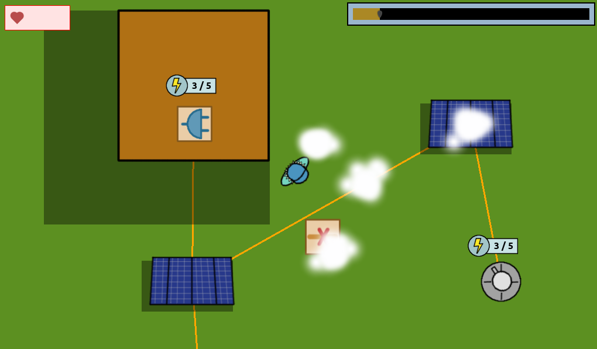

# Tirando cable

Juego para la Spain Game Dev Jam 3 (https://itch.io/jam/spain-game-devs-jam-iii)

## Trasfondo

¡Hay una invasión de fantasmas! Los científicos están investigando cómo acabar con ellos, ¡pero la red eléctrica está caída! Si únicamente hubiera un electricista dispuesto a arriesgarse para arreglar la red...

## Mecánicas

- Mantén el edificio de investigación conectado (¿o debería decir "unido"?) a la red eléctrica para que los científicos puedan concluir su investigación.
- Sobrevive a las oleadas de fantasmas conectando torretas a la red eléctrica.

**El juego dispone de tutorial integrado.**

## Créditos

### Idea y diseño

- Moisés J. Bonilla Caraballo (moisesjbc) - https://moisesjose.com

### Programación

- Moisés J. Bonilla Caraballo (moisesjbc) - https://moisesjose.com
- Licencia: GPL v3
- [Enlace al repositorio](https://github.com/moisesjbc/tirando-cable)

### Arte

- Moisés J. Bonilla Caraballo (moisesjbc) - https://moisesjose.com
- Licencia: Attribution-NonCommercial-ShareAlike 4.0 International

### SFX

- Moisés J. Bonilla Caraballo (moisesjbc) - https://moisesjose.com
- Licencia: Attribution-NonCommercial-ShareAlike 4.0 International

### Fuentes

- Ubuntu font - https://design.ubuntu.com/font/
- Licencia: https://ubuntu.com/legal/font-licence

### Software

- Godot engine - https://godotengine.org/
- Gimp - https://www.gimp.org/
- sfxr - http://www.drpetter.se/project_sfxr.html

## Agradecimientos

- A los organizadores de la Spain Game Devs Jam III - https://itch.io/jam/spain-game-devs-jam-iii

Hecho para la  Spain Game Devs Jam III - https://itch.io/jam/spain-game-devs-jam-iii
(Tema: "Unión")
